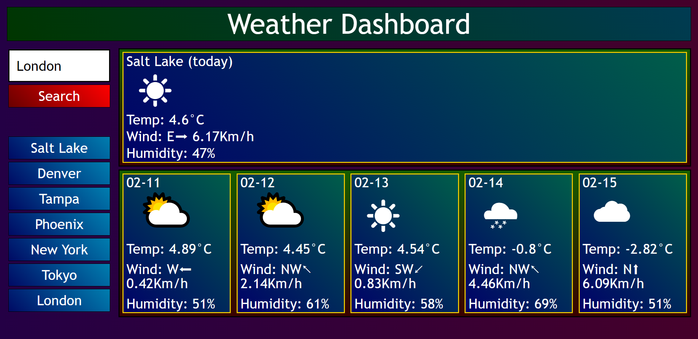

# weather-or-not

A website where you can search for a city, and it will automatically be saved so you can easily search for it again.

[Website](https://lord-xld3.github.io/weather-or-not/)

## Info

>*This DOES use the built-in geocoding API, which is considered (deprecated). HOWEVER, this presents a more difficult challenge, since we have to verify both fetch() requests are successful before saving the cityName to localStorage.*

>*If we were to rewrite this by fetching coordinates first, it would be trivial to handle that single fetch() request, then execute the rest of the code, because we can assume the next fetch() requests will be successful anyway.*

Not much planning went into this one, there is very little control flow to worry about. I went straight for 'getting the API data', then a time consuming process of handling errors and getting promises to work correctly (the secret sauce was using .catch at the END of our .then chain), and finally some refactoring + beautification.

Since I'm using TypeScript, please refer to /src/script.ts for cleaner code + comments.

CSS was a breeze. I'm not using any frameworks and this is certainly the most organized my code has ever been. I had to go back and forth a bit to show/hide elements and add event listeners.

HTML is well organized too, and I'm getting pretty good at using flex boxes.